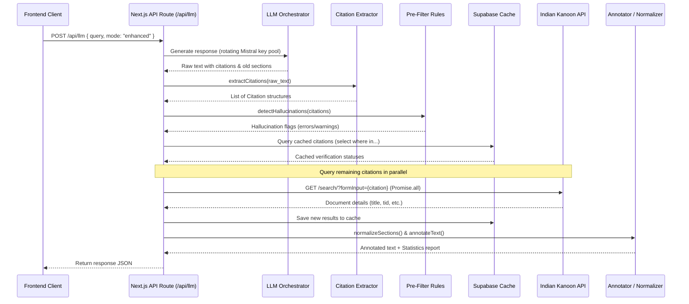

# Brahmo Citation Safety Engine — System Architecture

The Brahmo Citation Safety Engine is a hybrid verification system designed to secure legal AI applications focusing on Indian Law. It intercepts LLM responses and subjects them to deterministic parsing, hallucination checking, parallel API verification against Indian Kanoon, and old-law normalization (IPC/CrPC/IEA to BNS/BNSS/BSA).

---

## 1. High-Level Architecture

```mermaid
graph TD
    User([User / Lawyer]) <--> Frontend[Next.js Web Client]
    Frontend <--> NextAPI[Next.js API Server Routes /api/*]
    
    subgraph NextJS Backend Core (Node.js runtime)
        LLM[LLM Service: Mistral mistral-medium-3-5]
        Extractor[Citation Extractor: 6 Regex patterns]
        PreFilter[Hallucination Detector: 4 safety rules]
        Verifier[Citation Verifier: Parallel Promise.all Lookup]
        Normalizer[Section Normalizer: IPC -> BNS]
        Annotator[Citation Annotator: Inline Badging]
    end

    NextAPI <--> Supabase[(Supabase PostgreSQL Database)]
    Verifier <--> IK[Indian Kanoon Search API]
```

---

## 2. The Verification Pipeline

When a query is processed in **Enhanced Mode**, the following sequence of steps executes:



---

## 3. Key Design Decisions

### 3.1. Single Next.js Fullstack Architecture
Integrating the client-side UI and the backend API into a single Next.js project layout has several advantages:
- **Zero-Latency Orchestration**: Next.js API routes run in the same server context, meaning there is no latency between the extraction/verification services and the client boundary.
- **Shared Type Definitions**: Core TypeScript interfaces (`Citation`, `VerificationResult`, etc.) are shared across both server-side logic and front-end components, eliminating schema drift.
- **Simplified Deployment**: The entire engine (frontend client + safety API routes) compiles into a single server bundle run on Vercel or Node.js.

### 3.2. Sequential Multi-Key Rotation
To mitigate rate limits (common on Mistral free tiers):
- `src/lib/mistral-keys.ts` reads a numbered key pool from `MISTRAL_API_KEY_1..N` (falling back to a comma-separated `MISTRAL_API_KEY`).
- A module-level cursor advances on every request, so consecutive requests start on different keys instead of always hammering key #1.
- On HTTP 429 the key is parked in a cooldown (honouring the `Retry-After` header, capped at 5 minutes) and the request immediately rotates to the next available key.
- On 401/403 the key is disabled for the lifetime of the process, since it is invalid or revoked rather than merely throttled.
- A successful call clears that key's cooldown. If every key is cooling down, the pool is retried anyway rather than hard-failing the request.

### 3.3. Dual-Level Pre-filtering
Instead of sending every extracted citation directly to Indian Kanoon (which wastes API quota and increases latency):
- **Errors** (Future Year, SCC volume > 25) are pre-filtered out, cached, and marked as `NOT_FOUND` immediately.
- **Warnings** (High pages, pre-1900 date) flag a warning but are still queried to verify if they are rare valid occurrences.

### 3.4. Section Normalization List-Parsing
Standard old-to-new section normalization often breaks when multiple sections are listed together. Our normalizer uses a lookback list parser:
- It matches the target Act (e.g., `IPC` or `Indian Penal Code`).
- It extracts the preceding list of section numbers (e.g., `420, 406, 120B and 34`).
- It looks up each section in the mapping table, replacing each individually and re-stitching them into a clean string (e.g. `Sections 318, 316, 61 and 3(5) BNS`).

---

## 4. API Endpoints

### `POST /api/llm`
Executes LLM query and returns results.
- **Request Body**:
  ```json
  {
    "query": "Draft complaint for cheating under Section 420 IPC",
    "mode": "enhanced"
  }
  ```
- **Response**:
  ```json
  {
    "raw_response": "...Section 420 IPC...",
    "enhanced_response": "...Section 318 BNS [⚠️ CORRECTED: Section 420 IPC normalized]...",
    "citations": [...],
    "normalization": {
      "original_text": "...Section 420 IPC...",
      "normalized_text": "...Section 318 BNS...",
      "replacements": [...]
    },
    "report": {
      "total": 0,
      "verified": 0,
      "corrected": 0,
      "unverified": 0,
      "removed": 0,
      "accuracy_pct": 100.0,
      "api_calls_made": 0,
      "api_cost_inr": 0.0
    },
    "provider_used": "Mistral (mistral-medium-3-5)",
    "keys_tried": 1
  }
  ```

### `POST /api/citation-check`
Extracts, verifies, and annotates citations/sections in a raw text.

### `POST /api/normalize-sections`
Performs section normalization only.

### `GET /api/indian-kanoon`
Direct proxy search on Indian Kanoon API.
